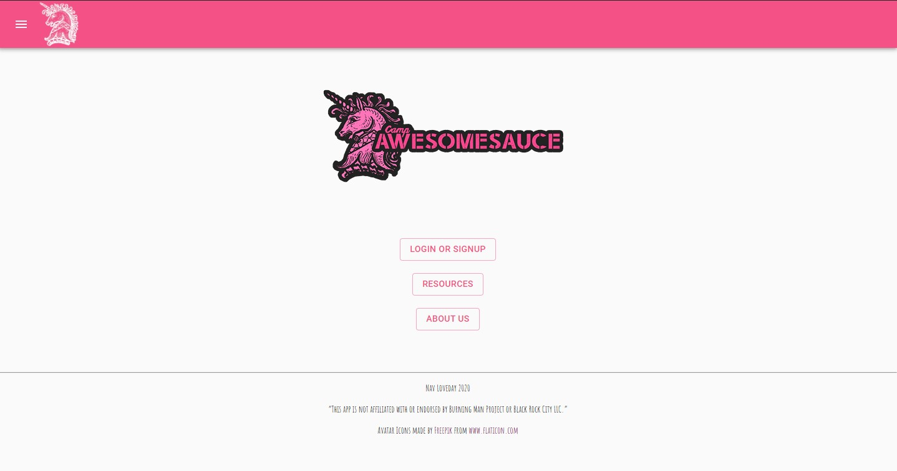
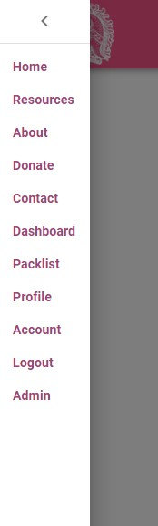
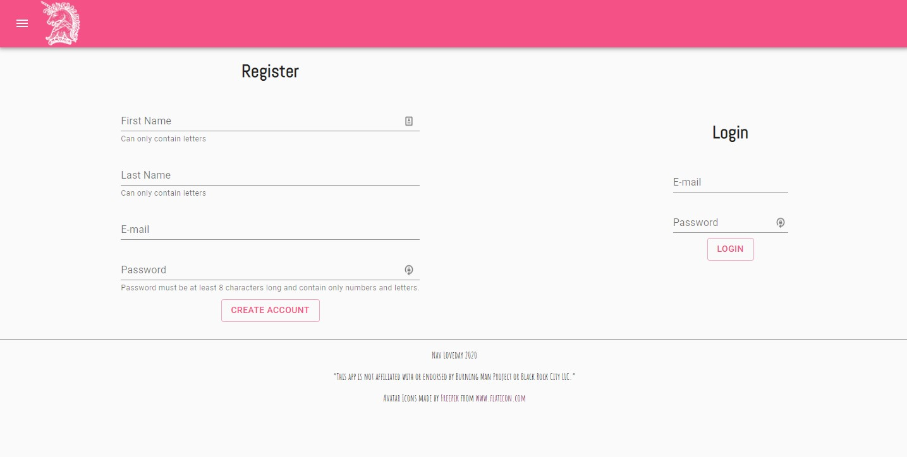
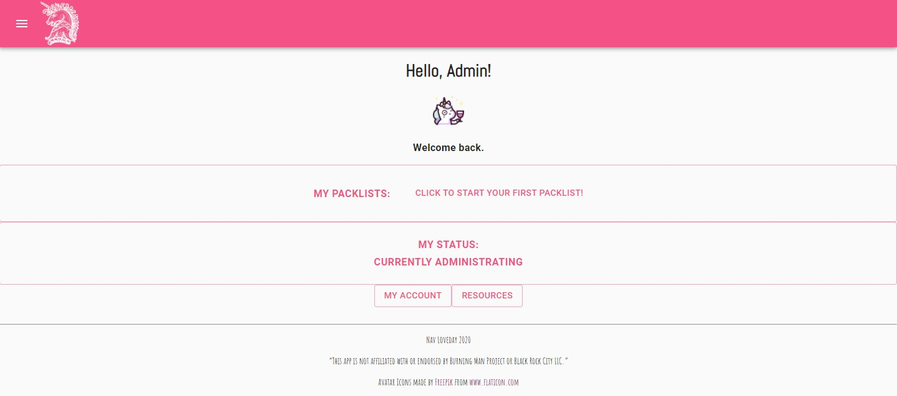
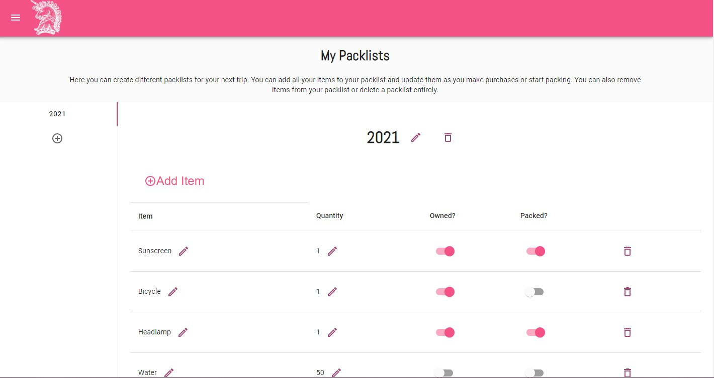
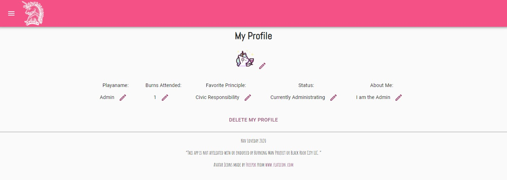
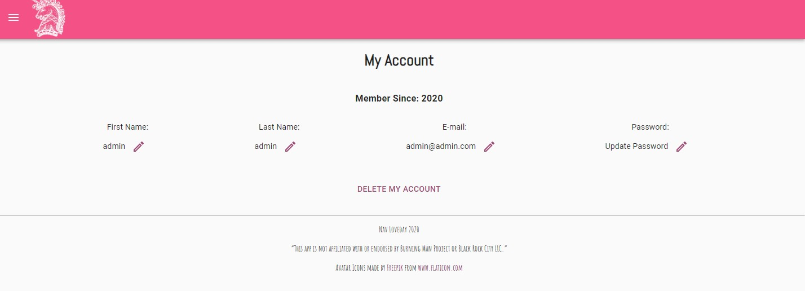
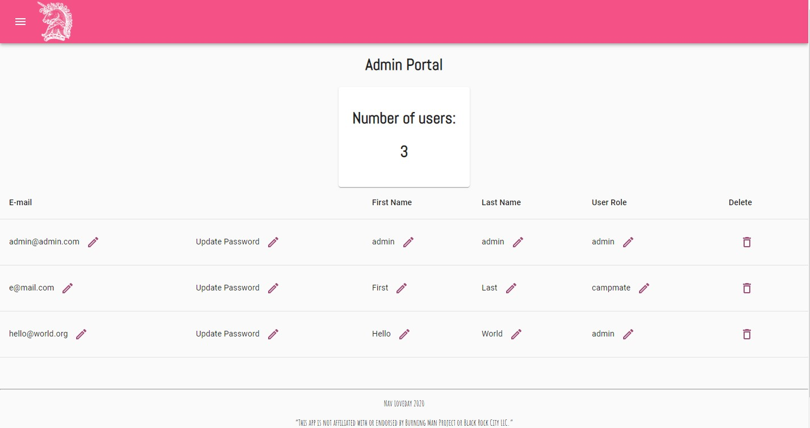

# **Camp Awesomesauce**

### Welcome to the Camp Awesomesauce App Client. 
You can use this app to make and manage packlists for your next burn. You can create an account, add some profile information, and find resources to ensure next year was better. 

You can find the deployed project [here](https://campawesomesauce.herokuapp.com/).
It pairs with the server side, found [here](https://github.com/adventurernav/CampAwesomesauce).

####  In honor of the Principles Radical Inclusion, Radical Self-Expression, Communal Effort, and Participation, your contributions are always welcome.

### Features
- Unregistered Guests can view general information about our theme camp, learn more about Burning Man and the 10 Principles, or make donations. 
- Users can register for an account, then view or update their information later. They can choose to delete their account. 
- Users can create a profile, then view or update their information later. They can choose to delete their profile. 
- Users can create any number of packlists. They can update or delete them later. 
- Users can add items to each packlist and update or delete them.
- Admins can manage the users' accounts, updating name, email, passwords or deleting users entirely.

### Technologies
#### This client is built with: 
- JavaScript
- React (legacy)
- Typescript
- Material UI
- Formik
- React-Router-DOM

### Cloning this project
Navigate to where you want the project cloned to in the command line. The client and server are seperate repos, so I suggest making a new folder. Let's make a few commands:
$ git clone https://github.com/adventurernav/CampAwesomesauce
$ npm i
$ npm start

Be sure to check out the readme on the server app if you want to clone that as well. 
For Demo purposes, I have the server already running. 

### Walkthrough
#### Home page

#### Navigation

The top left hamburger icon expands the left drawer to reveal the navigation links. 

#### Authorization

Users can sign up for a new account or login to an existing account. Admins will use this page to log in. 

#### Dashboard

From the dashboard, the user can see their recent packlists and their current status. These are also links to the packlist/profile pages respectively. 

#### Packlist 

Users can create packlists and add items to them. The user has the ability to edit or delete all packlists and items. The sliders update the items as they are flipped. 

#### Profile

From the profile page, the user can update their avatar, status, or other profile details. They may also choose to delete their profile. They will be re-routed back to the new profile page.

#### Account

Users can change their name, email, or update their password. 

#### Admin

Admin users may edit or delete user accounts. Any admin can promote other users to admin. 
